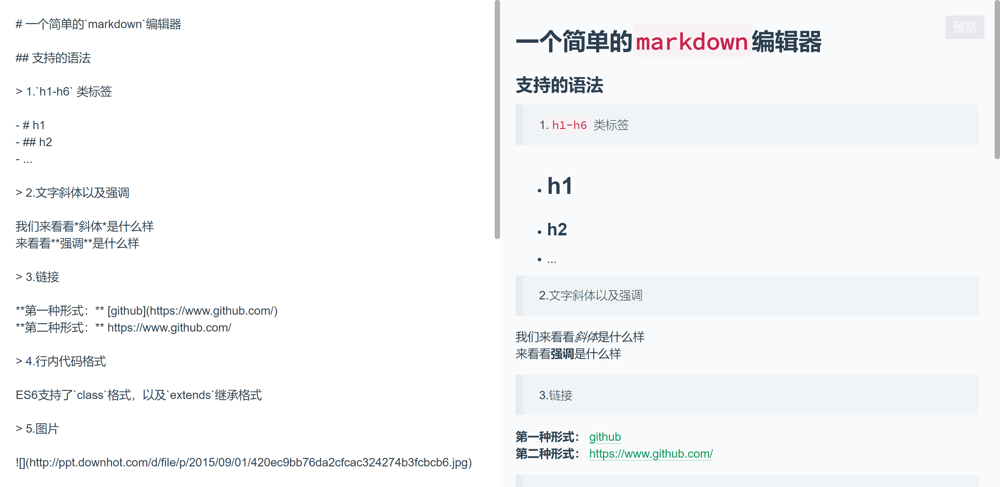

[](https://travis-ci.org/jiang43605/markdown-web)
---
> This is a markdown editor site, it is for learning nodejs, and I use it to write diaries and resume  
> see more details: `./content/.main`




## nodejs version
```
nodejs 8.0+
```

## use
```shell
git clone https://github.com/jiang43605/markdown-web.git
npm install
npm run build
node server.js
```

## admin manage url

```
// you can change it in ./server/manage.js
http://localhost:8080/manage.ok
```

## web.config.json(in ./config/web.config.json)

```
{
    "ipMaxCotentFiles": 11,  // each ip can create the largest number of file in ./content/*.(r|w|wr|rw|null)
    "ips": {
         "127.0.0.1":{       // visited users
             fileCount: 0,   // the number of files that have been created
             maxFileCount: ipMaxCotentFiles, // the maximum number of files that can be created, equal to ipMaxCotentFiles when init
             file: [] // record the file which create by 127.0.0.1
         },
    "mainPage": ".main",     // the file used to display the home page
    "managePagePath": "manage.ok",    // http://localhost:8080/manage.ok
    "password": "test.ok",   // used to change inaccessible or unmodifiable files, use:http://localhost:8080/test/test.ok
    "mainPassword": "admin.ok"       // you can modifiy home page in http://localhost:8080/admin.ok
    }
}
```

## content files

```
// in ./content
// each file ends with (r|w|wr|rw|null), 
// r means: canRead 
// w means: canWrite 
// null means: can't access
```

markdown syntax analysis: https://github.com/chjj/marked  
code syntax analysis: https://github.com/isagalaev/highlight.js
